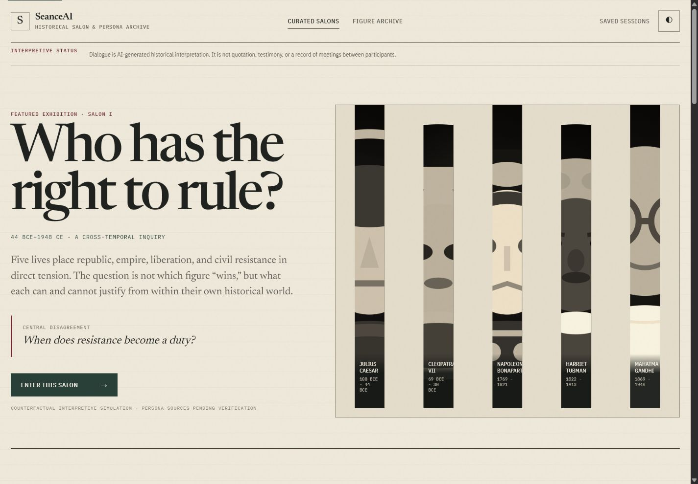
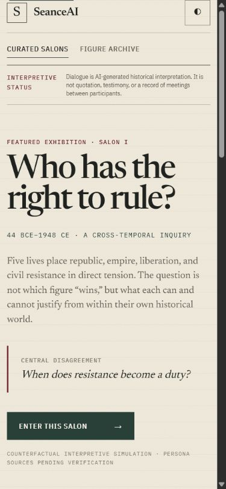
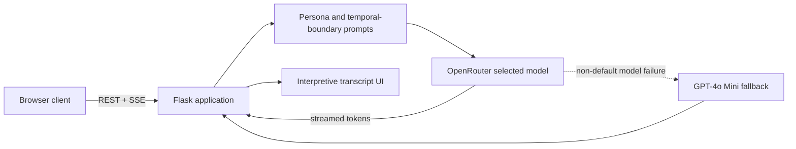

# SeanceAI

SeanceAI is an archival historical salon for AI-generated interpretive conversations. It pairs curated cross-temporal debates with a searchable archive of 57 historical-figure personas, visible knowledge cutoffs, and honest provenance states.

[Open the live application](https://seance-ai.up.railway.app/) · [View the portfolio](https://arjun-varma.com/)

> Dialogue is generated historical interpretation—not quotation, testimony, or a record of real meetings. Persona bibliographies and portrait provenance are explicitly marked as pending verification where the repository does not yet contain verified source records.

## Screenshots

### Curated salon — desktop



### Curated salon — mobile



## Product

### Curated salons

Curated salons are the primary experience. Three authored scenarios begin with a historical disagreement rather than a blank chat box:

1. **Who Has the Right to Rule?** — republic, empire, liberation, and civil resistance
2. **The Machine and the Moral Life** — capability, labor, and technological restraint
3. **Can Science Define Progress?** — evidence, authority, and moral consequence

Each salon supports two to five participants, streamed responses, contextual follow-up prompts, transcript export, local save/resume, and same-browser share links.

### Figure archive

All 57 original personas remain accessible through the searchable, period-filtered archive. Ten featured records add curatorial introductions, relevant locations, interpretive limitations, and historically grounded starter questions.

Every figure record exposes:

- lifespan and temporal knowledge cutoff;
- source-verification and portrait-provenance status;
- limitations or interpretive uncertainty;
- a clear separation between catalog context and generated dialogue.

## Architecture



- **Backend:** Flask, Requests, Server-Sent Events
- **Model gateway:** OpenRouter with selectable model tiers and fallback handling
- **Production server:** Gunicorn with gevent workers for streaming
- **Frontend:** semantic HTML, CSS, and vanilla JavaScript—no build step
- **Persistence:** browser `localStorage` for sessions, branches, preferences, and local share links
- **Deployment:** Railway via the GitHub-linked `main` branch

## Historical safeguards

- Prompts prohibit fabricated quotations, meetings, relationships, memories, and source material.
- Questions about events after a figure's death require an explicit lifetime boundary.
- Reactions to later concepts must be labeled as speculation after the moderator supplies context.
- Cross-temporal salons are labeled counterfactual and never imply that participants met.
- Missing bibliographies display **Sources pending verification** instead of invented citations.
- “Why this may be historically plausible” surfaces dates, persona constraints, and uncertainty—not hidden chain-of-thought.

## Run locally

Requirements: Python 3.10+ and an [OpenRouter](https://openrouter.ai/) API key.

```bash
git clone https://github.com/ARJUNVARMA2000/Seance_AI.git
cd Seance_AI
cp .env.example .env
# Add your OPENROUTER_API_KEY to .env
python -m pip install -r requirements.txt
python app.py
```

Open `http://localhost:5000`.

## Tests

```bash
python -m unittest discover -s tests -v
python -m py_compile app.py figures.py tests/test_app.py
node --check static/js/app.js
```

The test suite covers catalog preservation, featured metadata, curated-salon limits, temporal prompt safeguards, public routes, API fields, and input validation.

## Deployment

Production is hosted at [seance-ai.up.railway.app](https://seance-ai.up.railway.app/). Railway builds with Nixpacks and starts:

```bash
gunicorn app:app --config gunicorn_config.py
```

The linked Railway production service deploys commits pushed to `origin/main`. Runtime configuration, including `OPENROUTER_API_KEY`, is managed in Railway rather than committed to the repository.

## Source status

The product now has a complete provenance interface, but the repository still needs an owner or historian review before any persona can be described as source-verified. Until then, the UI intentionally preserves the pending state.
