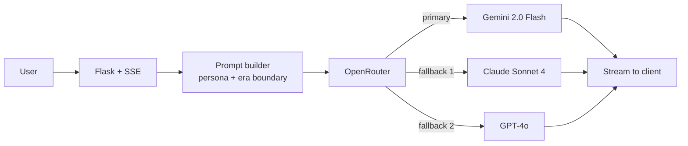

# SeanceAI

Enter curated interpretive salons with 57 historical-figure personas, streaming responses, and visible temporal knowledge boundaries. Every generated conversation is labeled as interpretation rather than quotation or historical record.

- **Live demo:** https://seance-ai.up.railway.app
- **Portfolio:** https://arjun-varma.com/

## Problem

History education often feels distant and abstract. Students read about historical figures in textbooks but rarely get to experience their personalities, perspectives, or thought processes. Traditional learning methods don't capture authentic voices or contextual knowledge.

The goal: a source-conscious educational experience that makes historical viewpoints, disagreement, and temporal limits legible through generated interpretive conversations.

## Challenge

- Creating believable personas that speak in era-appropriate language and knowledge
- Ensuring historical figures don't reference events after their death (temporal knowledge boundaries)
- Designing an engaging UI that feels like a museum exhibit, not just another chatbot
- Implementing multi-figure conversations where multiple historical personalities interact naturally
- Managing API costs and rate limits while providing smooth streaming responses
- Handling model fallbacks gracefully when primary models hit rate limits

## Approach

1. **Curatorial framework** — persona notes, knowledge boundaries, and interpretive limitations are visible; verified source lists are still pending repository-owner review
2. **Dual conversation modes** — Seance Mode (1-on-1) and Dinner Party Mode (2–5 figures) for different interaction styles
3. **Model selection and fallback** — OpenRouter integration with selectable model tiers and a reliable configured fallback
4. **Archival editorial design** — salon dossiers, catalog records, transcript folios, and restrained portrait plates
5. **Progressive features** — contextual suggestions, conversation history, save/resume, export options

## Solution / Architecture



**Components:**

- **Flask backend** — REST API with Server-Sent Events (SSE) for streaming and intelligent retry logic
- **OpenRouter integration** — flexible AI model access with automatic fallback handling
- **57 historical figures** — Ancient World, Renaissance, 19th Century, Modern Era
- **Archival editorial web UI** — responsive salon dossiers, figure catalog, conversation history, and multi-mode support
- **Railway deployment** — containerized Flask with environment-based configuration

Each persona prompt supplies distinct interpretive notes and a hard lifetime boundary. Responses to later concepts must state that boundary and label any ensuing reaction as speculation.

## Impact / Results

- Deployed to production on Railway with reliable uptime
- 57 historical figures across multiple eras, with ten featured curatorial records
- Both intimate 1-on-1 conversations and dynamic multi-figure dinner parties
- Educational value for history learning, critical thinking, and creative writing
- Full-stack demonstration: AI integration, streaming, persona engineering, deployment

## Tech Stack

Python · Flask · Server-Sent Events · OpenRouter API · multi-model fallbacks · Railway

## Run Locally

```bash
git clone https://github.com/ARJUNVARMA2000/Seance_AI.git
cd Seance_AI
cp .env.example .env   # add OPENROUTER_API_KEY
pip install -r requirements.txt
python app.py
```

## License

MIT
