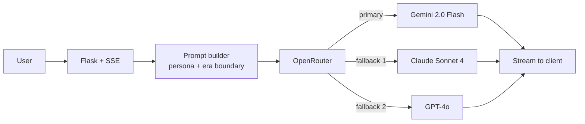

# SeanceAI

Converse with 60+ historical figures. Authentic era-appropriate personas, streaming responses, and a Dinner Party mode where multiple figures debate each other.

- **Live demo:** https://seance-ai.up.railway.app
- **Portfolio:** https://arjun-varma.com/

## Problem

History education often feels distant and abstract. Students read about historical figures in textbooks but rarely get to experience their personalities, perspectives, or thought processes. Traditional learning methods don't capture authentic voices or contextual knowledge.

The goal: an immersive educational experience that brings history to life through AI-powered conversations with legendary figures from different eras.

## Challenge

- Creating believable personas that speak in era-appropriate language and knowledge
- Ensuring historical figures don't reference events after their death (temporal knowledge boundaries)
- Designing an engaging UI that feels like a museum exhibit, not just another chatbot
- Implementing multi-figure conversations where multiple historical personalities interact naturally
- Managing API costs and rate limits while providing smooth streaming responses
- Handling model fallbacks gracefully when primary models hit rate limits

## Approach

1. **Historical research** — documented sources drive authentic personalities, speaking styles, and knowledge boundaries for 60+ figures
2. **Dual conversation modes** — Seance Mode (1-on-1) and Dinner Party Mode (2–5 figures) for different interaction styles
3. **Smart model selection** — OpenRouter integration with automatic fallback: primary free models (Gemini 2.0 Flash) with premium fallbacks (GPT-4o, Claude Sonnet)
4. **Museum-themed design** — dark UI with gold accents, SVG portraits, smooth animations
5. **Progressive features** — contextual suggestions, conversation history, save/resume, export options

## Solution / Architecture



**Components:**

- **Flask backend** — REST API with Server-Sent Events (SSE) for streaming and intelligent retry logic
- **OpenRouter integration** — flexible AI model access with automatic fallback handling
- **60+ historical figures** — Ancient World, Renaissance, 19th Century, Modern Era
- **Museum-themed web UI** — responsive, figure selection, conversation history, multi-mode support
- **Railway deployment** — containerized Flask with environment-based configuration

Each figure maintains a unique voice, era-appropriate knowledge, and genuine reactions to modern concepts they couldn't have known.

## Impact / Results

- Deployed to production on Railway with reliable uptime
- 60+ historical figures across multiple eras
- Both intimate 1-on-1 conversations and dynamic multi-figure dinner parties
- Educational value for history learning, critical thinking, and creative writing
- Full-stack demonstration: AI integration, streaming, persona engineering, deployment

## Tech Stack

Python · Flask · Server-Sent Events · OpenRouter API · multi-model fallbacks · Railway

## Run Locally

```bash
git clone https://github.com/ARJUNVARMA2000/Seance_AI.git
cd Seance_AI
cp .env.example .env   # add OPENROUTER_API_KEY
pip install -r requirements.txt
python app.py
```

## License

MIT
